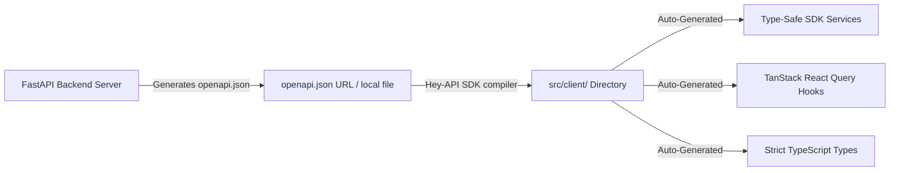

This guide details the contract-first SDK generation, schema parsers, client authorization headers, and automated contract synchronization guardrails.

---

## 🧬 OpenAPI Contract-First Strategy

To eliminate communication drift between frontend components and backend services, this project adopts a contract-first SDK architecture. Rather than writing manual AJAX calls or matching TS interface types by hand, the entire networking layer is compiled directly from the FastAPI OpenAPI JSON schema representation.



---

## ⚙️ Hey API Code Generator Configuration

SDK compilation is orchestrated by `@hey-api/openapi-ts` through [openapi-ts.config.ts](file:///Users/sreerajsreenivasan/Sree/Learn/react/react-frontend-template/openapi-ts.config.ts).

### Configuration Options

The compilation options are configured as follows:

```typescript
import { defineConfig } from "@hey-api/openapi-ts";
import { existsSync } from "node:fs";

const input = existsSync("./openapi.json")
  ? "./openapi.json"
  : "http://localhost:8000/openapi.json";

export default defineConfig({
  input,
  output: "src/client",
  plugins: [
    "@hey-api/client-fetch",
    "@hey-api/typescript",
    {
      name: "@hey-api/sdk",
      asSDK: true,
    },
    "@tanstack/react-query",
  ],
});
```

### Compiler Phases

1.  **Schema Retrieval**: Resolves local static `./openapi.json` caches first to support offline compiles, falling back to downloading live metadata from the active API container server if the cache is missing.
2.  **TS Type Synthesizer**: Ingests schema descriptions and writes compile-safe models into `src/client/types.gen.ts`.
3.  **SDK Operations Compiler**: Emits object-oriented SDK methods mapped to HTTP routes into `src/client/sdk.gen.ts`.
4.  **TanStack Query Decorator**: Builds cached, reactive React hooks inside the `@tanstack/` subfolder using generated queries.

---

## 🔒 SDK Authorization Header Binding

Client headers are configured inside the generated fetch instance in `src/client/client.gen.ts`. Token lifecycle modifications are managed in [src/lib/auth.ts](file:///Users/sreerajsreenivasan/Sree/Learn/react/react-frontend-template/src/lib/auth.ts):

- **Initialization Flow**: On application launch, `auth.initialize()` fetches the local token from localStorage and configures `client.setConfig` headers with `Authorization: Bearer <token>`.
- **Dynamic Base URL Parsing**: Evaluates local environments to automatically bind active host locations (`client.setConfig({ baseUrl: getApiBaseUrl() })`).
- **Authentication Session Upgrades**: On successful logins, `auth.setToken()` updates localStorage and updates the active client headers dynamically.
- **Session Reset Cycles**: On logout actions, `auth.clearToken()` deletes localStorage records and resets authorization headers to `undefined`.

---

## 🚀 Consumption Examples in React Components

By utilizing auto-generated TanStack Query hooks, query operations and optimistic state mutations become simple:

### 1. Data Retrieval Query

```typescript
import { useQuery } from "@tanstack/react-query";
import { readTasksApiV1TasksGet } from "../client/sdk.gen";

const { data, isLoading, error } = useQuery({
  queryKey: ["tasks"],
  queryFn: () =>
    readTasksApiV1TasksGet({
      query: {
        skip: 0,
        limit: 10,
      },
    }),
});
```

### 2. State Mutation with TanStack Query

```typescript
import { useMutation, useQueryClient } from "@tanstack/react-query";
import { createTaskApiV1TasksPost } from "../client/sdk.gen";

const queryClient = useQueryClient();

const { mutate } = useMutation({
  mutationFn: (newTaskData) =>
    createTaskApiV1TasksPost({
      body: newTaskData,
    }),
  onSuccess: () => {
    // Invalidate queries to trigger background fetches
    queryClient.invalidateQueries({ queryKey: ["tasks"] });
  },
});
```

---

## 🛡️ CI/CD API Schema Integrity Check

To prevent code degradation or runtime failures caused by out-of-sync API contracts, the codebase features an automated **API Sync Check** guardrail in GitHub Actions (`.github/workflows/frontend.yml`).

If a backend developer modifies a route parameter or model definition on the server without subsequently running `npm run generate-client` on the frontend, the validation task fails during compilation checks, blocking deployment.
