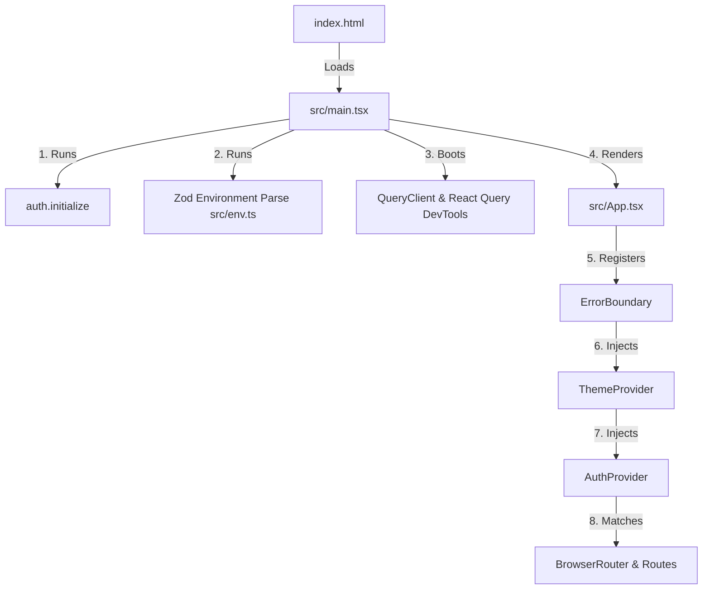

This page provides an architectural deep dive into the frontend template, detailing folder layouts, execution lifecycles, routing definitions, global state handlers, and the styling system.

---

## 📂 Project Directory Structure

The structure organizes standard react components, styling, SDK systems, and environments cleanly:

```text
├── .env.example              # Template for configuring environment variables
├── .nvmrc                    # Enforces Node.js v22.14.0 execution version
├── openapi-ts.config.ts      # Configuration configuration for Hey API client generation
├── package.json              # Defines NPM scripts and active dependency tree
├── tsconfig.json             # Root TypeScript compilation preferences
├── vite.config.js            # Configuration settings for Vite 8 and Tailwind plugins
└── src
    ├── App.test.tsx          # Root unit test validation
    ├── App.tsx               # Orchestrates global context wraps and route endpoints
    ├── env.ts                # Runtime Zod validation structure for environment variables
    ├── index.css             # Root Tailwind CSS 4 setup and global variables
    ├── main.tsx              # Application index entry point
    ├── test-utils.tsx        # Common testing mock contexts wrapper
    ├── client                # Auto-generated API client files
    │   ├── @tanstack         # Generated React Query hooks
    │   ├── core              # Native fetch wrappers and headers orchestration
    │   └── sdk.gen.ts        # Type-safe client endpoints file
    ├── components            # Visual layouts and pages
    │   ├── Login.tsx         # Combined authorization/registration view
    │   ├── Dashboard.tsx     # Workspace selector for user tasks or admin lists
    │   ├── Profile.tsx       # Account manager (delete operations, updates)
    │   ├── admin             # Components managing user lists and administrator profiles
    │   ├── auth              # Route security gates (ProtectedRoute)
    │   ├── layout            # Scaffolds (DashboardLayout, Sidebar)
    │   ├── tasks             # Component items rendering tasks lists and item cards
    │   └── ui                # Shadcn primitives (Card, Button, Input, Modal, Label)
    ├── contexts              # Multi-component state providers (Auth, Theme)
    ├── lib                   # General helper functions (Error handlers, Auth cookies)
    └── types                 # Custom internal interface mappings
```

---

## ⚡ Execution Lifecycle & Entry Points

The application initialization follows a predictable, fail-safe path starting from the DOM layer to React rendering:



### 1. `src/main.tsx`

- Initializes client auth hooks: `auth.initialize()` fetches the local token from localStorage and configures global fetch header authorizations.
- Instantiates the global `QueryClient` setting a default query `staleTime` of 5 minutes, query retries to 1, and disabling background window refetch queries (`refetchOnWindowFocus: false`).
- Injects the `QueryClientProvider` and renders the tree.

### 2. `src/App.tsx`

- Acts as the central router and layout controller.
- Surrounds application nodes with an `ErrorBoundary` component to isolate runtime render failures.
- Nests the `ThemeProvider` and `AuthProvider` providers before dispatching browser routes.

---

## 🛣️ Declarative Routing (React Router 7)

Routes are managed using declarative mapping logic in `src/App.tsx`:

- **Public Access**: `/login` points directly to the auth gate screen.
- **Default Landing Route**: `/` resolves a `ProtectedRoute` wrapping the main user/admin `Dashboard`.
- **Profile Account Lifecycle**: `/profile` points to a `ProtectedRoute` nesting `ProtectedLayout` (which configures the sidebar skeleton) surrounding the active `Profile` dashboard.
- **Administrative Dashboard**: `/users` provides route-level gate constraints by requiring the user role `Role.ADMIN` inside the `ProtectedRoute` attributes.
- **Redirect Gate**: Non-matching routes (`*`) are routed back to the index page (`/`) using a browser redirect component.

---

## 🎨 Styling System (Tailwind CSS 4 + Shadcn)

The user interface implements the latest **Tailwind CSS 4** standard, which simplifies style definition via direct CSS directives rather than complex configuration files.

### 1. Root Integration

Vite loads `@import "tailwindcss";` in `src/index.css` alongside `@tailwindcss/vite` plugin compilation.

### 2. CSS Custom Theme Declarations (`@theme`)

Tailwind 4 custom variables map CSS variables directly into tailwind classes inside the `@theme` block:

```css
@theme {
  --color-background: var(--background);
  --color-foreground: var(--foreground);
  --color-card: var(--card);
  --color-primary: var(--primary);
  --color-ring: var(--ring);
}
```

### 3. Harmonic Color Palette (Light & Dark Schemes)

Adaptive schemes are configured directly via CSS custom variables in `:root` and `.dark` blocks:

- **Light Theme (`:root`)**: Active by default. Employs soft whites and slates (`--background: #ffffff`, `--primary: #6366f1` Indigo, `--muted-foreground: #64748b`).
- **Dark Theme (`.dark`)**: Triggered by appending the `.dark` class to the document root element. Employs a premium slate-midnight color system (`--background: #020617`, `--card: #0f172a`, `--primary: #818cf8`, `--border: #1e293b`).

### 4. Interactive & Micro-Animation Tokens

The framework includes helper classes to support visual transitions:

- **Glassmorphism CSS Class**: `.glass` applies structural blur effects (`backdrop-filter: blur(8px)`) coupled with light boundary lines.
- **Color Fades**: The body element declares `transition-colors duration-300` to smoothly transition light and dark mode switches.
