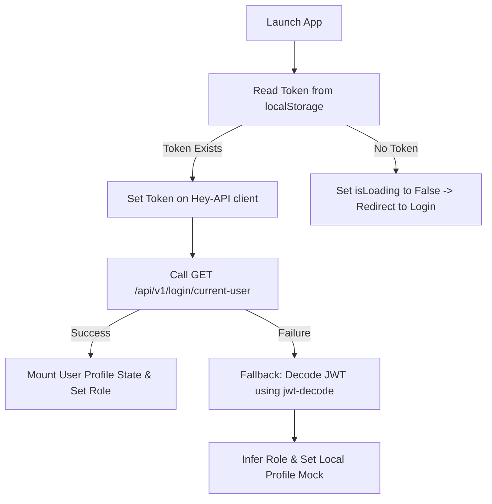

This guide outlines the authorization architecture, session lifecycle, role hierarches, interceptor loops, and route-protection wrappers.

---

## 👥 Role Hierarchy

The application establishes a clear hierarchical access control model represented by the `Role` enum in [src/contexts/AuthContext.tsx](file:///Users/sreerajsreenivasan/Sree/Learn/react/react-frontend-template/src/contexts/AuthContext.tsx):

```typescript
export enum Role {
  SUPER = "SUPER",
  ADMIN = "ADMIN",
  USER = "USER",
}
```

### Permission Matrix

Permissions resolve linearly down the chain:

- **`Role.SUPER`**: Full administrative clearance. Inherits all admin and user capabilities.
- **`Role.ADMIN`**: Clearance to access administration dashboard views, list all system accounts, modify user state fields, and register new administrators. Inherits all user capabilities.
- **`Role.USER`**: Restricted clearance. Standard account operation for task lists, task mutations, and individual profile updates.

---

## 🔄 Authentication Context (`AuthProvider`)

The global application state mounts a React Context called `<AuthProvider />` that holds authentication values.

### Context Properties

The state exports the following variables and methods via the `useAuth()` hook:

| Property Name         | Data Type            | Purpose                                                                                           |
| :-------------------- | :------------------- | :------------------------------------------------------------------------------------------------ |
| `user`                | `UserPublic \| null` | Stores the active profile metadata parsed from the database.                                      |
| `token`               | `string \| null`     | Holds the active session JWT token.                                                               |
| `role`                | `Role \| null`       | Tracks the resolved role of the user.                                                             |
| `isAuthenticated`     | `boolean`            | Quick utility computed from `!!token`.                                                            |
| `isLoading`           | `boolean`            | Flag indicating whether credentials check processes are active.                                   |
| `accessDenied`        | `boolean`            | Flag indicating if a `403 Forbidden` API intercept has triggered.                                 |
| `login(token)`        | `function`           | Accepts a newly generated token string, updates client references, and retrieves the profile.     |
| `logout()`            | `function`           | Resets all context fields, purges memory tokens, and forces an immediate page reload to `/login`. |
| `hasPermission(role)` | `function`           | Compares active user role hierarchy value against requested clearance thresholds.                 |

---

## 🧬 Token Validation & Profiling Lifecycle

The application prioritizes robust validation checks when initializing or upgrading credentials.



### JWT Fallback Logic

If the backend is momentarily unreachable, the authentication system falls back to locally parsing the token:

1. Decodes the token using `jwt-decode`.
2. Identifies sub claims, emails, and role variables (`role` or `user_role`).
3. Locally binds a temporary `UserPublic` model profile to allow partial offline page rendering.

---

## 🛡️ API Request Interceptors

The context sets up response and error interceptors inside the Hey API fetch client configuration during initialization:

### 1. The `401 Unauthorized` Pipeline (Session Expiry)

- **Trigger**: A fetch request returns `401` status OR response details specifically contain `"Token expired"`.
- **Action**: Calls `logout()`, which deletes local cookie caches and performs a hard browser replacement to `/login?expired=true`. This avoids infinite redirection loops by bypassing React Router history hooks.

### 2. The `403 Forbidden` Pipeline (Insufficient Clearance)

- **Trigger**: An API returns a `403` status.
- **Action**: Sets the context property `accessDenied` to `true`.
- **UI Overlay**: When `accessDenied` is `true`, a global modal `<AccessDeniedOverlay />` is mounted over the layout. It blurs background layout content using `bg-black/60 backdrop-blur-sm` and prompts the user to dismiss the warning or log in with higher privileges.

---

## 🛣️ Route Guards (`ProtectedRoute`)

Specific routes in the application structure are protected by the `<ProtectedRoute />` wrapper:

```typescript
// Example: Restricting routes to administrators
<Route
  path="/users"
  element={
    <ProtectedRoute requiredRole={Role.ADMIN}>
      <Dashboard defaultView="admin" />
    </ProtectedRoute>
  }
/>
```

### Processing Algorithm

1. Checks the `isLoading` state variable. Displays a centered animated spinning loader if loading.
2. If `isAuthenticated` is `false`, it saves the current location path to React Router state and performs a redirect to `/login`.
3. If a `requiredRole` is declared, it executes `hasPermission(requiredRole)`.
4. If permissions are insufficient, it halts rendering and mounts a beautiful custom centered **Access Denied** panel outlining required clearance and featuring a "Go Back" history button.
