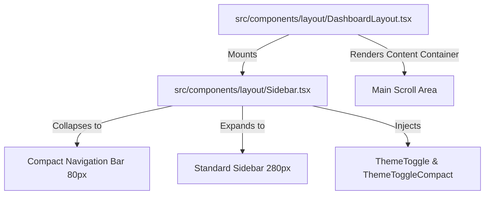
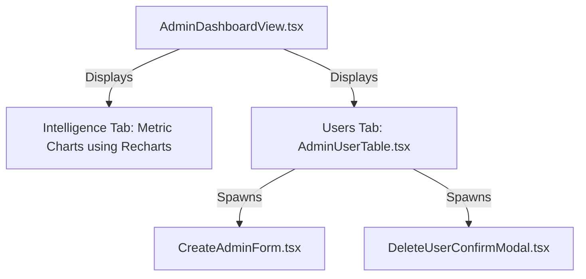

This catalog details the structural shell layouts, interactive dashboard panels, task boards, and administrative widgets powering the user interface.

---

## 🎨 Visual Component Philosophy

Components follow a standardized pattern built using **shadcn/ui** and **Lucide Icons** backed by **Tailwind CSS 4**:

- **Responsive Adaptability**: Layouts automatically reorganize themselves, shifting dynamically between mobile, tablet, and widescreen.
- **Accessibility First**: Inputs and interactive elements leverage native focus ring tokens (`focus-visible:ring-2`) and standard label wrappers.
- **Theme Synchronization**: Elements respond immediately to theme context changes, adjusting borders, shadows, backgrounds, and font weights.

---

## 🏗️ Structural Shell Layouts

The application shell provides the framing scaffold for dashboard screens.

### 1. `DashboardLayout.tsx`

- Sets up a dual-column screen structure: a sidebar navigation on the left, and a main fluid content dashboard wrapper on the right.
- Declares responsive breakpoints: on large viewports (`lg:relative`), the sidebar occupies static space; on smaller breakpoints, a slide-out drawer mechanism is activated using a mobile-only overlay.
- Forces the content dashboard wrapper to fit inside `h-screen` and sets `overflow-y-auto` to prevent outer browser scrolling issues.

### 2. `Sidebar.tsx`

- Defines the app navigation list mapping matching role permissions.
- Provides user profile summaries displaying name details and an uppercase role badge.
- Implements sidebar collapsing states managed via `isCollapsed` state transitions (`lg:w-20` vs `lg:w-[var(--sidebar-width)]`).
- Houses the **`ThemeToggle`** / **`ThemeToggleCompact`** icons to trigger theme changes.

---

## ✅ Task Management Workspace (`src/components/tasks`)

The user workspace is built around task organization boards:

- **`UserTaskView.tsx`**: Orchestrates filtering tabs (All, Open, Completed), search inputs, and prioritizations, rendering lists dynamically.
- **`TaskBoard.tsx`**: Wraps cards, displays summaries (counters for outstanding tasks), and initiates inline creators.
- **`TaskCard.tsx`**: Visual card using custom indicators for priority levels (High, Medium, Low). Provides delete icons and edit modals.
- **`TaskForm.tsx`**: Validated task editor sheet using Zod models. Automatically processes task updates via optimistic TanStack mutations.

---

## 👤 Profile & Lifecycle Manager (`src/components/Profile.tsx`)

A dedicated dashboard page managing user accounts:

- **Detail Mutation Form**: Supports changing names, email variables, and localization configurations.
- **Credential Update Card**: Safely triggers password updates.
- **Destruction Dialog**: Allows users to permanently delete their account. This forces a password verification check, purges all user tasks from the backend database, and executes a local `logout()` redirect.

---

## 🛠️ Administrative Control Center (`src/components/admin`)

Administrators are provided with a dedicated control center:

### 1. `AdminDashboardView.tsx`

- Features a statistics board: active accounts counter, total task tallies, and database health metrics.
- Visualizes API request telemetry (e.g. success-to-failure ratios) using clean charts powered by **Recharts**.

### 2. `AdminUserTable.tsx`

- Renders a high-performance grid tracking registered accounts.
- Provides toggle switches to activate or deactivate users instantly.
- Supports fast table search filters and column sorting.

### 3. `CreateAdminForm.tsx`

- Provides an administrative modal form to register new administrators.
- Validates input values using Zod schema constraints before submitting requests to the backend.

### 4. `DeleteUserConfirmModal.tsx`

- A destructive deletion protection prompt that forces administrators to type the target account email to confirm the action.
