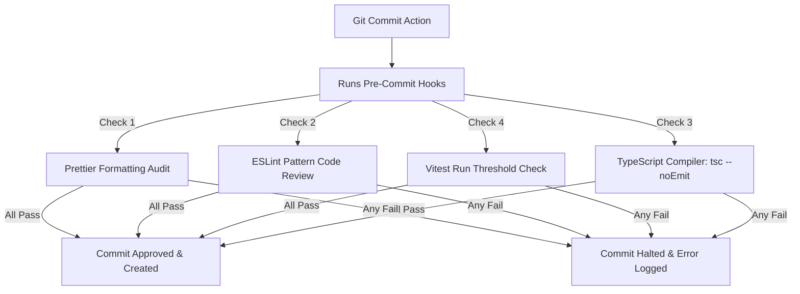

# Quality Assurance & Testing Guide

This guide details the Vitest framework setup, JSDOM browser simulation, custom React Testing Library render overrides, code coverage specifications, and automatic Git commit guardrails.

---

## 🧪 Testing Infrastructure

The repository implements a comprehensive test runner environment powered by **Vitest** for extreme execution speeds and **React Testing Library (RTL)** for component interaction models.

### Test Environment Profile

The configuration defined in [vite.config.js](file:///Users/sreerajsreenivasan/Sree/Learn/react/react-frontend-template/vite.config.js) details:

- **Virtual DOM**: `jsdom` emulation layer providing accurate browser-like APIs (e.g., localStorage, document querying).
- **Globals Execution**: `globals: true` configuration, enabling test hooks (`describe`, `test`, `expect`, `beforeEach`) to be referenced globally across files.
- **Setup Orchestrator**: Runs `./src/test/setup.ts` to clear mock systems, extend jest-dom assertion matchers, and suppress unnecessary standard logging noise during assertion tasks.
- **Timeout Guard**: Sets `testTimeout: 10000` (10 seconds) to allow asynchronous async queries to complete without early test failures.

---

## 🧬 Custom Rendering Utilities (`test-utils.tsx`)

Testing complex React components requires proper surrounding contexts (e.g. routing history and caching engines). Rather than duplicating boilerplate setups inside every test file, developers consume a custom render utility configured in [src/test-utils.tsx](file:///Users/sreerajsreenivasan/Sree/Learn/react/react-frontend-template/src/test-utils.tsx):

```typescript
const createTestQueryClient = () =>
  new QueryClient({
    defaultOptions: {
      queries: { retry: false },
      mutations: { retry: false },
    },
  });

const AllTheProviders = ({ children }: { children: React.ReactNode }) => {
  const queryClient = createTestQueryClient();
  return (
    <QueryClientProvider client={queryClient}>
      <ThemeProvider defaultTheme="light" storageKey="test-theme">
        <MemoryRouter>{children}</MemoryRouter>
      </ThemeProvider>
    </QueryClientProvider>
  );
};
```

### Context Isolation Features

1.  **Retry Suppression**: The custom QueryClient overrides API request retries (`retry: false`) during tests. This prevents failing network tests from retrying indefinitely, speeding up the test suite.
2.  **State Cleanliness**: Instantiates a fresh `QueryClient` per execution thread to guarantee database isolation between individual specs.
3.  **Router Simulation**: Wraps children in a `MemoryRouter` context to support checking route actions and navigation events.
4.  **RTL Render Override**: Exports a custom `render` wrapper that automatically applies these contexts to the target component under test.

---

## 📈 Strict Code-Coverage Standards

The project maintains high standards for reliability with a robust test suite that measures coverage across multiple categories:

| Target Category | Mandated Threshold | Excluded Folders                           |
| :-------------- | :----------------- | :----------------------------------------- |
| **Statements**  | `92.0%`            | `src/client/**` (Auto-generated SDK files) |
| **Lines**       | `92.0%`            | `src/test/**` (Mock engines)               |
| **Functions**   | `85.0%`            | `src/main.tsx` (Static entry point)        |
| **Branches**    | `80.0%`            | `src/**/*.test.*` (Self-test assertions)   |

### Executing Reports

- **Interactive Watch Mode**: Best during active feature modification:
  ```bash
  npm test
  ```
- **Threshold Audit**: Executes tests once and asserts that coverage parameters match thresholds:
  ```bash
  npm run test:run
  ```
- **HTML Visual Reports**: Outputs files to the `/coverage` directory:
  ```bash
  npm run test:coverage
  ```

---

## 🛡️ Automated Local Pre-Commit Guardrails

To prevent breaking changes from reaching remote branches, the repository configures automatic Git checks via python-based **`pre-commit`** configurations:



These gates ensure all committed code is fully formatted, passes static analysis, compiles correctly, and satisfies the required test coverage thresholds before being pushed to CI.
